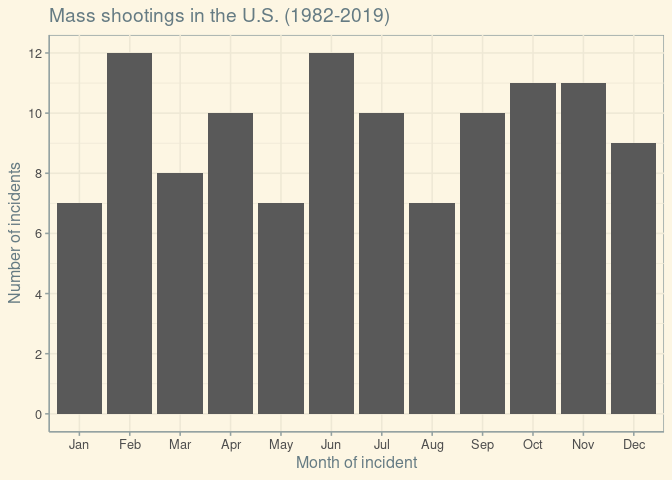
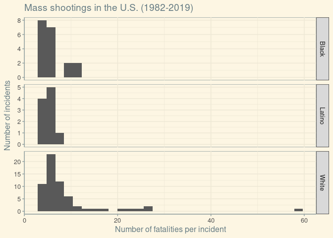
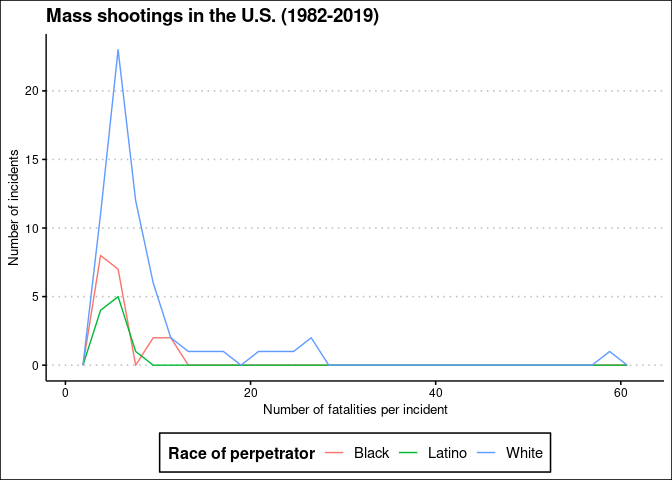
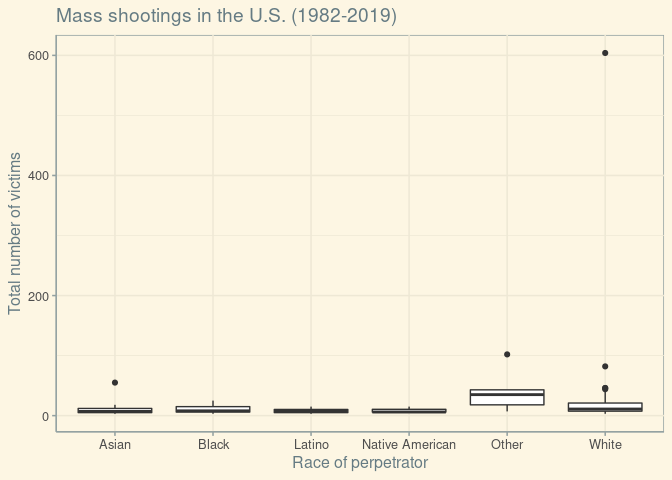
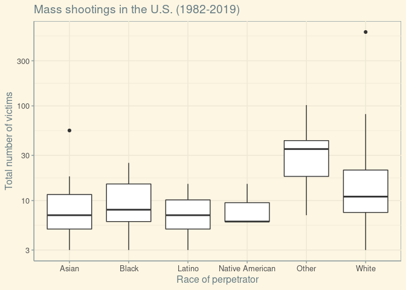
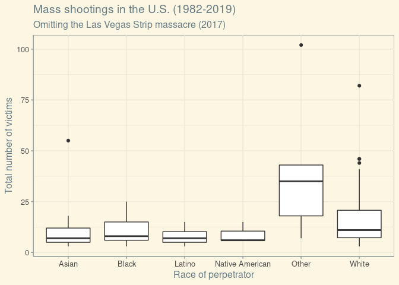
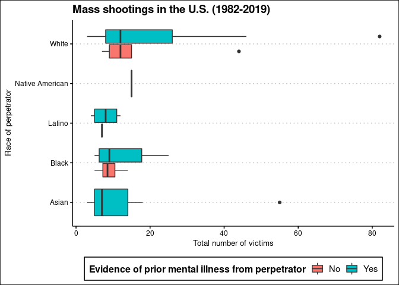

HW2: Exploring Mass Shootings in America
================
Julia Du

## Get the data

``` r
library(tidyverse)    # load tidyverse packages, including ggplot2
```

    ## ── Attaching packages ─────────────────────────────────────── tidyverse 1.3.0 ──

    ## ✓ ggplot2 3.3.3     ✓ purrr   0.3.4
    ## ✓ tibble  3.0.4     ✓ dplyr   1.0.2
    ## ✓ tidyr   1.1.2     ✓ stringr 1.4.0
    ## ✓ readr   1.4.0     ✓ forcats 0.5.0

    ## ── Conflicts ────────────────────────────────────────── tidyverse_conflicts() ──
    ## x dplyr::filter() masks stats::filter()
    ## x dplyr::lag()    masks stats::lag()

``` r
library(knitr)        # load functions for formatting tables
library(ggthemes) 

# get data from rcfss package
# install latest version if not already installed
# devtools::install_github("uc-cfss/rcfss")
library(rcfss)

# load the data
data("mass_shootings")
mass_shootings
```

    ## # A tibble: 114 x 14
    ##    case   year month   day location summary fatalities injured total_victims
    ##    <chr> <dbl> <chr> <int> <chr>    <chr>        <dbl>   <dbl>         <dbl>
    ##  1 Dayt…  2019 Aug       4 Dayton,… "PENDI…          9      27            36
    ##  2 El P…  2019 Aug       3 El Paso… "PENDI…         20      26            46
    ##  3 Gilr…  2019 Jul      28 Gilroy,… "Santi…          3      12            15
    ##  4 Virg…  2019 May      31 Virgini… "DeWay…         12       4            16
    ##  5 Harr…  2019 Feb      15 Aurora,… "Gary …          5       6            11
    ##  6 Penn…  2019 Jan      24 State C… "Jorda…          3       1             4
    ##  7 SunT…  2019 Jan      23 Sebring… "Zephe…          5       0             5
    ##  8 Merc…  2018 Nov      19 Chicago… "Juan …          3       0             3
    ##  9 Thou…  2018 Nov       7 Thousan… "Ian D…         12      22            34
    ## 10 Tree…  2018 Oct      27 Pittsbu… "Rober…         11       6            17
    ## # … with 104 more rows, and 5 more variables: location_type <chr>, male <lgl>,
    ## #   age_of_shooter <dbl>, race <chr>, prior_mental_illness <chr>

## Generate a data frame that summarizes the number of mass shootings per year. Print the data frame as a formatted `kable()` table.

``` r
mass_shootings %>%
  group_by(year) %>%
  summarize(
    count = n()
  ) %>%
  kable(caption = "Mass shootings (1982-2019)", col.names = c("Year", "Number of mass shootings"))
```

    ## `summarise()` ungrouping output (override with `.groups` argument)

| Year | Number of mass shootings |
| ---: | -----------------------: |
| 1982 |                        1 |
| 1984 |                        2 |
| 1986 |                        1 |
| 1987 |                        1 |
| 1988 |                        1 |
| 1989 |                        2 |
| 1990 |                        1 |
| 1991 |                        3 |
| 1992 |                        2 |
| 1993 |                        4 |
| 1994 |                        1 |
| 1995 |                        1 |
| 1996 |                        1 |
| 1997 |                        2 |
| 1998 |                        3 |
| 1999 |                        5 |
| 2000 |                        1 |
| 2001 |                        1 |
| 2003 |                        1 |
| 2004 |                        1 |
| 2005 |                        2 |
| 2006 |                        3 |
| 2007 |                        4 |
| 2008 |                        3 |
| 2009 |                        4 |
| 2010 |                        1 |
| 2011 |                        3 |
| 2012 |                        7 |
| 2013 |                        5 |
| 2014 |                        4 |
| 2015 |                        7 |
| 2016 |                        6 |
| 2017 |                       11 |
| 2018 |                       12 |
| 2019 |                        7 |

Mass shootings (1982-2019)

## Generate a bar chart that identifies the number of mass shooters associated with each race category. The bars should be sorted from highest to lowest.

``` r
library(forcats)
require(forcats)

mass_shootings %>%
  drop_na(race) %>%
  group_by(race) %>%
  summarize(
    count = n() 
  ) %>% ungroup() %>%
  ggplot(mapping = aes(x=fct_reorder(race, -count), y = count)) + #we use -count to sort by descending
  geom_col() +
  labs(title = "Mass shootings in the U.S. (1982-2019)", x = "Race of perpetrator", y = "Number of incidents") +
  theme_solarized()
```

    ## `summarise()` ungrouping output (override with `.groups` argument)

<!-- -->

## Generate a boxplot visualizing the number of total victims, by type of location. Redraw the same plot, but remove the Las Vegas Strip massacre from the dataset.

``` r
# w/ the LV Strip massacre
ggplot(data = mass_shootings, mapping = aes(x = location_type, y = total_victims)) +
 geom_boxplot() +
  labs(title = "Mass shootings in the U.S. (1982-2019)", x = "Type of location of incident", y = "Total number of victims") +
  theme_solarized()
```

<!-- -->

``` r
#omitting LV Strip massacre
mass_shootings %>%
    filter(case != "Las Vegas Strip massacre") %>%
  ggplot(mapping = aes(x = location_type, y = total_victims)) +
 geom_boxplot() +
  labs(title = "Mass shootings in the U.S. (1982-2019)", subtitle = "Omitting the Las Vegas Strip massacre (2017)", x = "Type of location of incident", y = "Total number of victims") +
  theme_solarized()
```

<!-- -->

## How many white males with prior signs of mental illness initiated a mass shooting after 2000?

``` r
#filter by race = "White", male = TRUE, prior_mental_illness = "Yes", year > 2000
mass_shootings %>%
  filter(race == "White", male, prior_mental_illness == "Yes", year > 2000) %>% 
  mutate(white_after2000 = row_number()) %>%
  glimpse()
```

    ## Rows: 20
    ## Columns: 15
    ## $ case                 <chr> "SunTrust bank shooting", "Waffle House shooting…
    ## $ year                 <dbl> 2019, 2018, 2018, 2017, 2017, 2014, 2013, 2012, …
    ## $ month                <chr> "Jan", "Apr", "Feb", "Nov", "May", "May", "Jun",…
    ## $ day                  <int> 23, 22, 14, 5, 12, 23, 7, 14, 27, 5, 20, 20, 12,…
    ## $ location             <chr> "Sebring, FL", "Nashville, TN", "Parkland, FL", …
    ## $ summary              <chr> "Zephen A. Xaver, 21, fatally shot five women in…
    ## $ fatalities           <dbl> 5, 4, 17, 26, 3, 6, 6, 27, 7, 7, 12, 6, 8, 6, 8,…
    ## $ injured              <dbl> 0, 4, 17, 20, 0, 13, 3, 2, 1, 3, 70, 1, 1, 13, 3…
    ## $ total_victims        <dbl> 5, 8, 34, 46, 3, 19, 9, 29, 8, 10, 82, 7, 9, 19,…
    ## $ location_type        <chr> "Workplace", "Other", "School", "Religious", "Wo…
    ## $ male                 <lgl> TRUE, TRUE, TRUE, TRUE, TRUE, TRUE, TRUE, TRUE, …
    ## $ age_of_shooter       <dbl> 21, 29, 19, 26, 43, 22, 23, 20, 36, 40, 24, 40, …
    ## $ race                 <chr> "White", "White", "White", "White", "White", "Wh…
    ## $ prior_mental_illness <chr> "Yes", "Yes", "Yes", "Yes", "Yes", "Yes", "Yes",…
    ## $ white_after2000      <int> 1, 2, 3, 4, 5, 6, 7, 8, 9, 10, 11, 12, 13, 14, 1…

> **20 white males with prior signs of mental illness initiated a mass
> shooting after 2000.**

## Which month of the year has the most mass shootings? Generate a bar chart sorted in chronological order to provide evidence of your answer.

``` r
mass_shootings %>%
#  drop_na(month) %>% turns out we didn't need to drop NA here since there are no NA values for months
  mutate(month = factor(month,
                  levels = month.abb)) %>%
  count(month) %>%
  ggplot(mapping = aes(x=month, y = n)) +
  geom_col() +
  labs(title = "Mass shootings in the U.S. (1982-2019)", x = "Month of incident", y = "Number of incidents") +
  scale_y_continuous(breaks=seq(0,12,2)) +
  theme_solarized()
```

<!-- -->

> **February and June have the most mass shootings.**

## How does the distribution of mass shooting fatalities differ between white and black shooters? What about white and latino shooters?

``` r
#need to group shooters by race. filter only white, black, or latino. 
#faceted graphs
mass_shootings %>%
  group_by(race) %>%
  filter(
    race %in% c("White", "Black", "Latino")
  ) %>%
  ggplot(mapping = aes(x = fatalities)) +
  geom_histogram() +
  labs(title = "Mass shootings in the U.S. (1982-2019)", x = "Number of fatalities per incident", y = "Number of incidents") +
  facet_grid(race ~ ., scales = "free") +
  theme_solarized()
```

    ## `stat_bin()` using `bins = 30`. Pick better value with `binwidth`.

<!-- -->

``` r
mass_shootings %>%
  group_by(race) %>%
  filter(
    race %in% c("White", "Black", "Latino")
  ) %>%
  ggplot(mapping = aes(x = fatalities)) +
  geom_histogram() +
  labs(title = "Mass shootings in the U.S. (1982-2019)", x = "Number of fatalities per incident", y = "Number of incidents") +
  facet_wrap(race ~ ., scales = "free") +
  theme_solarized()
```

    ## `stat_bin()` using `bins = 30`. Pick better value with `binwidth`.

<!-- -->

``` r
#freq polygon
mass_shootings %>%
  group_by(race) %>%
  filter(
    race %in% c("White", "Black", "Latino")
  ) %>%
  ggplot(mapping = aes(x = fatalities, color = race)) +
  geom_freqpoly() +
  labs(title = "Mass shootings in the U.S. (1982-2019)", x = "Number of fatalities per incident", y = "Number of incidents") +
  scale_color_discrete(name="Race of perpetrator") +
  theme_clean() +
  theme(legend.position = "bottom") 
```

    ## `stat_bin()` using `bins = 30`. Pick better value with `binwidth`.

<!-- -->

> For white, Latino, & Black shooters, the distribution of mass shooting
> fatalities seems to be right skewed. The white distribution has a
> notable large outlier of roughly 60 fatalities in one incident - this
> is the Las Vegas massacre. The Black distribution seems slightly more
> spread out than the Latino distribution, but the Black distribution is
> definitely less spread out than the white distribution. The Latino
> distribution seems the most densely packed together and more centered
> than the others, though that could be chalked up to its smaller sample
> size.

> There are many more white shooters than Black and Latino shooters.
> There are slightly more Black shooters than Latino shooters.

## Are mass shootings with shooters suffering from mental illness different from mass shootings with no signs of mental illness in the shooter? Assess the relationship between mental illness and total victims, mental illness and race, and the intersection of all three variables.

``` r
#need to create graphs between mental illness & total victims. mental illness & race. then create a final graph between mental illness, race, & total victims.

#mental illness vs total victims
mass_shootings %>%
  drop_na(prior_mental_illness) %>%
  ggplot(mapping = aes(x = prior_mental_illness, y = total_victims)) +
 geom_boxplot() +
  labs(title = "Mass shootings in the U.S. (1982-2019)", x = "Evidence of prior mental illness from perpetrator", y = "Total number of victims") +
  theme_solarized()
```

<!-- -->

``` r
##mental illness vs race 
ggplot(data = na.omit(mass_shootings[, c("prior_mental_illness", "race")]), mapping = aes(x = prior_mental_illness, fill = race)) +
  geom_bar(position = position_dodge2(width = 0.9, preserve = "single")) +
  labs(title = "Mass shootings in the U.S. (1982-2019)", x = "Evidence of prior mental illness from perpetrator", y = "Number of perpetrators") +
  scale_fill_discrete(name="Race of perpetrator") +
  theme_clean()
```

<!-- -->

``` r
#victims vs race
mass_shootings %>%
  drop_na(race) %>%
  ggplot(mapping = aes(x = race, y = total_victims)) +
 geom_boxplot() +
  labs(title = "Mass shootings in the U.S. (1982-2019)", x = "Race of perpetrator", y = "Total number of victims") +
  theme_solarized()
```

<!-- -->

``` r
#victims vs race - w/ log y-axis
mass_shootings %>%
  drop_na(race) %>%
  ggplot(mapping = aes(x = race, y = total_victims)) +
 geom_boxplot() +
  labs(title = "Mass shootings in the U.S. (1982-2019)", x = "Race of perpetrator", y = "Total number of victims") +
    scale_y_continuous(trans = "log10") +
  theme_solarized()
```

<!-- -->

``` r
#victims vs race, w/ LV massacre omitted
mass_shootings %>%
  filter(case != "Las Vegas Strip massacre") %>%
  drop_na(race) %>%
  ggplot(mapping = aes(x = race, y = total_victims)) +
 geom_boxplot() +
  labs(title = "Mass shootings in the U.S. (1982-2019)", subtitle = "Omitting the Las Vegas Strip massacre (2017)", x = "Race of perpetrator", y = "Total number of victims") +
  theme_solarized()
```

<!-- -->

``` r
#victims vs race, by mental illness 
mass_shootings %>%
  drop_na(race, prior_mental_illness) %>%
  ggplot(mapping = aes(x = total_victims, y = race, fill = prior_mental_illness)) +
 geom_boxplot() +
  labs(title = "Mass shootings in the U.S. (1982-2019)", x = "Total number of victims", y = "Race of perpetrator") +
  scale_fill_discrete(name="Evidence of prior mental illness from perpetrator") +
  theme_clean() +
  theme(legend.position="bottom") 
```

<!-- -->

``` r
#mental illness vs victims, by race 
mass_shootings %>%
  drop_na(race, prior_mental_illness) %>%
  ggplot(mapping = aes(x = prior_mental_illness, y = total_victims, fill = race)) +
 geom_boxplot() +
  labs(title = "Mass shootings in the U.S. (1982-2019)", x = "Evidence of prior mental illness from perpetrator", y = "Total number of victims") +
  scale_fill_discrete(name="Race of perpetrator") +
  theme_clean() +
  theme(legend.position="bottom")
```

<!-- -->

> **In general, it doesn’t seem like evidence of prior mental illness
> has that large of an effect on the number of total victims per
> incident.** The median \# of total victims for perpetrators with
> mental illness is a bit higher, but it’s relatively close to
> perpetrators without mental illness. However, perpetrators with mental
> illness do have a much larger upper bound of total victims, especially
> for white perpetrators. \> **It seems that white perpetrators with
> mental illness tended to have higher total \# of victims.**

> **Disregarding mental illness, white perpetrators seem to have a
> higher total \#s of victims per incident.** White perpetrators had a
> slightly higher median \# of total victims and a larger upper bound on
> total victims - with the exception of perpetrators of race “Other.”
> Perpetrators with “Other” race have a noticeably higher median total
> \# of victims than other races, but because there are only 5 such
> perpetrators (i.e.the sample size is much smaller), we should be
> careful about concluding anything from that. Moreover, there was no
> info on if any of these “Other” race perpetrators showed evidence of
> prior mental illness.

> **Across most races, it seems that it was more common for perpetrators
> to have evidence of prior mental illness than not.**

## Session info

``` r
devtools::session_info()
```

    ## ─ Session info ───────────────────────────────────────────────────────────────
    ##  setting  value                               
    ##  version  R version 4.0.1 (2020-06-06)        
    ##  os       Red Hat Enterprise Linux 8.3 (Ootpa)
    ##  system   x86_64, linux-gnu                   
    ##  ui       X11                                 
    ##  language (EN)                                
    ##  collate  en_US.UTF-8                         
    ##  ctype    en_US.UTF-8                         
    ##  tz       America/Chicago                     
    ##  date     2021-01-22                          
    ## 
    ## ─ Packages ───────────────────────────────────────────────────────────────────
    ##  package     * version date       lib source                        
    ##  assertthat    0.2.1   2019-03-21 [2] CRAN (R 4.0.1)                
    ##  backports     1.2.1   2020-12-09 [2] CRAN (R 4.0.1)                
    ##  broom         0.7.3   2020-12-16 [2] CRAN (R 4.0.1)                
    ##  callr         3.5.1   2020-10-13 [2] CRAN (R 4.0.1)                
    ##  cellranger    1.1.0   2016-07-27 [2] CRAN (R 4.0.1)                
    ##  cli           2.2.0   2020-11-20 [2] CRAN (R 4.0.1)                
    ##  colorspace    2.0-0   2020-11-11 [2] CRAN (R 4.0.1)                
    ##  crayon        1.3.4   2017-09-16 [2] CRAN (R 4.0.1)                
    ##  DBI           1.1.0   2019-12-15 [2] CRAN (R 4.0.1)                
    ##  dbplyr        2.0.0   2020-11-03 [2] CRAN (R 4.0.1)                
    ##  desc          1.2.0   2018-05-01 [2] CRAN (R 4.0.1)                
    ##  devtools      2.3.2   2020-09-18 [1] CRAN (R 4.0.1)                
    ##  digest        0.6.27  2020-10-24 [2] CRAN (R 4.0.1)                
    ##  dplyr       * 1.0.2   2020-08-18 [2] CRAN (R 4.0.1)                
    ##  ellipsis      0.3.1   2020-05-15 [2] CRAN (R 4.0.1)                
    ##  evaluate      0.14    2019-05-28 [2] CRAN (R 4.0.1)                
    ##  fansi         0.4.1   2020-01-08 [2] CRAN (R 4.0.1)                
    ##  farver        2.0.3   2020-01-16 [2] CRAN (R 4.0.1)                
    ##  forcats     * 0.5.0   2020-03-01 [2] CRAN (R 4.0.1)                
    ##  fs            1.5.0   2020-07-31 [2] CRAN (R 4.0.1)                
    ##  generics      0.1.0   2020-10-31 [2] CRAN (R 4.0.1)                
    ##  ggplot2     * 3.3.3   2020-12-30 [2] CRAN (R 4.0.1)                
    ##  ggthemes    * 4.2.4   2021-01-20 [1] CRAN (R 4.0.1)                
    ##  glue          1.4.2   2020-08-27 [2] CRAN (R 4.0.1)                
    ##  gtable        0.3.0   2019-03-25 [2] CRAN (R 4.0.1)                
    ##  haven         2.3.1   2020-06-01 [2] CRAN (R 4.0.1)                
    ##  highr         0.8     2019-03-20 [2] CRAN (R 4.0.1)                
    ##  hms           0.5.3   2020-01-08 [2] CRAN (R 4.0.1)                
    ##  htmltools     0.4.0   2019-10-04 [2] CRAN (R 4.0.1)                
    ##  httr          1.4.2   2020-07-20 [2] CRAN (R 4.0.1)                
    ##  jsonlite      1.7.2   2020-12-09 [2] CRAN (R 4.0.1)                
    ##  knitr       * 1.30    2020-09-22 [2] CRAN (R 4.0.1)                
    ##  labeling      0.4.2   2020-10-20 [2] CRAN (R 4.0.1)                
    ##  lifecycle     0.2.0   2020-03-06 [2] CRAN (R 4.0.1)                
    ##  lubridate     1.7.9.2 2020-11-13 [2] CRAN (R 4.0.1)                
    ##  magrittr      2.0.1   2020-11-17 [2] CRAN (R 4.0.1)                
    ##  memoise       1.1.0   2017-04-21 [2] CRAN (R 4.0.1)                
    ##  modelr        0.1.8   2020-05-19 [2] CRAN (R 4.0.1)                
    ##  munsell       0.5.0   2018-06-12 [2] CRAN (R 4.0.1)                
    ##  pillar        1.4.7   2020-11-20 [2] CRAN (R 4.0.1)                
    ##  pkgbuild      1.2.0   2020-12-15 [2] CRAN (R 4.0.1)                
    ##  pkgconfig     2.0.3   2019-09-22 [2] CRAN (R 4.0.1)                
    ##  pkgload       1.1.0   2020-05-29 [2] CRAN (R 4.0.1)                
    ##  prettyunits   1.1.1   2020-01-24 [2] CRAN (R 4.0.1)                
    ##  processx      3.4.5   2020-11-30 [2] CRAN (R 4.0.1)                
    ##  ps            1.5.0   2020-12-05 [2] CRAN (R 4.0.1)                
    ##  purrr       * 0.3.4   2020-04-17 [2] CRAN (R 4.0.1)                
    ##  R6            2.5.0   2020-10-28 [2] CRAN (R 4.0.1)                
    ##  rcfss       * 0.2.1   2021-01-05 [2] Github (uc-cfss/rcfss@36e77a2)
    ##  Rcpp          1.0.5   2020-07-06 [2] CRAN (R 4.0.1)                
    ##  readr       * 1.4.0   2020-10-05 [2] CRAN (R 4.0.1)                
    ##  readxl        1.3.1   2019-03-13 [2] CRAN (R 4.0.1)                
    ##  remotes       2.2.0   2020-07-21 [2] CRAN (R 4.0.1)                
    ##  reprex        0.3.0   2019-05-16 [2] CRAN (R 4.0.1)                
    ##  rlang         0.4.10  2020-12-30 [2] CRAN (R 4.0.1)                
    ##  rmarkdown     2.6     2020-12-14 [2] CRAN (R 4.0.1)                
    ##  rprojroot     2.0.2   2020-11-15 [2] CRAN (R 4.0.1)                
    ##  rstudioapi    0.13    2020-11-12 [2] CRAN (R 4.0.1)                
    ##  rvest         0.3.6   2020-07-25 [2] CRAN (R 4.0.1)                
    ##  scales        1.1.1   2020-05-11 [2] CRAN (R 4.0.1)                
    ##  sessioninfo   1.1.1   2018-11-05 [2] CRAN (R 4.0.1)                
    ##  stringi       1.5.3   2020-09-09 [2] CRAN (R 4.0.1)                
    ##  stringr     * 1.4.0   2019-02-10 [2] CRAN (R 4.0.1)                
    ##  testthat      3.0.1   2020-12-17 [2] CRAN (R 4.0.1)                
    ##  tibble      * 3.0.4   2020-10-12 [2] CRAN (R 4.0.1)                
    ##  tidyr       * 1.1.2   2020-08-27 [2] CRAN (R 4.0.1)                
    ##  tidyselect    1.1.0   2020-05-11 [2] CRAN (R 4.0.1)                
    ##  tidyverse   * 1.3.0   2019-11-21 [1] CRAN (R 4.0.1)                
    ##  usethis       2.0.0   2020-12-10 [1] CRAN (R 4.0.1)                
    ##  utf8          1.1.4   2018-05-24 [2] CRAN (R 4.0.1)                
    ##  vctrs         0.3.6   2020-12-17 [2] CRAN (R 4.0.1)                
    ##  withr         2.3.0   2020-09-22 [2] CRAN (R 4.0.1)                
    ##  xfun          0.19    2020-10-30 [2] CRAN (R 4.0.1)                
    ##  xml2          1.3.2   2020-04-23 [2] CRAN (R 4.0.1)                
    ##  yaml          2.2.1   2020-02-01 [2] CRAN (R 4.0.1)                
    ## 
    ## [1] /home/duj/R/x86_64-pc-linux-gnu-library/4.0
    ## [2] /opt/R/4.0.1/lib/R/library
