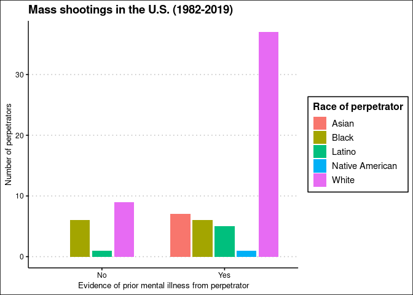

HW2: Exploring Mass Shootings in America
================
Julia Du

## Get the data

``` r
library(tidyverse)    # load tidyverse packages, including ggplot2
```

    ## ── Attaching packages ─────────────────────────────────────── tidyverse 1.3.0 ──

    ## ✓ ggplot2 3.3.3     ✓ purrr   0.3.4
    ## ✓ tibble  3.0.4     ✓ dplyr   1.0.2
    ## ✓ tidyr   1.1.2     ✓ stringr 1.4.0
    ## ✓ readr   1.4.0     ✓ forcats 0.5.0

    ## ── Conflicts ────────────────────────────────────────── tidyverse_conflicts() ──
    ## x dplyr::filter() masks stats::filter()
    ## x dplyr::lag()    masks stats::lag()

``` r
library(knitr)        # load functions for formatting tables

# get data from rcfss package
# install latest version if not already installed
# devtools::install_github("uc-cfss/rcfss")
library(rcfss)

# load the data
data("mass_shootings")
mass_shootings
```

    ## # A tibble: 114 x 14
    ##    case   year month   day location summary fatalities injured total_victims
    ##    <chr> <dbl> <chr> <int> <chr>    <chr>        <dbl>   <dbl>         <dbl>
    ##  1 Dayt…  2019 Aug       4 Dayton,… "PENDI…          9      27            36
    ##  2 El P…  2019 Aug       3 El Paso… "PENDI…         20      26            46
    ##  3 Gilr…  2019 Jul      28 Gilroy,… "Santi…          3      12            15
    ##  4 Virg…  2019 May      31 Virgini… "DeWay…         12       4            16
    ##  5 Harr…  2019 Feb      15 Aurora,… "Gary …          5       6            11
    ##  6 Penn…  2019 Jan      24 State C… "Jorda…          3       1             4
    ##  7 SunT…  2019 Jan      23 Sebring… "Zephe…          5       0             5
    ##  8 Merc…  2018 Nov      19 Chicago… "Juan …          3       0             3
    ##  9 Thou…  2018 Nov       7 Thousan… "Ian D…         12      22            34
    ## 10 Tree…  2018 Oct      27 Pittsbu… "Rober…         11       6            17
    ## # … with 104 more rows, and 5 more variables: location_type <chr>, male <lgl>,
    ## #   age_of_shooter <dbl>, race <chr>, prior_mental_illness <chr>

## Generate a data frame that summarizes the number of mass shootings per year. Print the data frame as a formatted `kable()` table.

``` r
#shootings_yr = group_by(.data = mass_shootings, year)
#summarize(.data = shootings_yr, count=n())

### same as above, but with a pipe
shootings_yrpipe = mass_shootings %>%
  group_by(year) %>%
  summarize(
    count = n()
  )
```

    ## `summarise()` ungrouping output (override with `.groups` argument)

``` r
kable(shootings_yrpipe, caption = "Mass shootings (1982-2019)", col.names = c("Year", "Number of mass shootings"))
```

| Year | Number of mass shootings |
| ---: | -----------------------: |
| 1982 |                        1 |
| 1984 |                        2 |
| 1986 |                        1 |
| 1987 |                        1 |
| 1988 |                        1 |
| 1989 |                        2 |
| 1990 |                        1 |
| 1991 |                        3 |
| 1992 |                        2 |
| 1993 |                        4 |
| 1994 |                        1 |
| 1995 |                        1 |
| 1996 |                        1 |
| 1997 |                        2 |
| 1998 |                        3 |
| 1999 |                        5 |
| 2000 |                        1 |
| 2001 |                        1 |
| 2003 |                        1 |
| 2004 |                        1 |
| 2005 |                        2 |
| 2006 |                        3 |
| 2007 |                        4 |
| 2008 |                        3 |
| 2009 |                        4 |
| 2010 |                        1 |
| 2011 |                        3 |
| 2012 |                        7 |
| 2013 |                        5 |
| 2014 |                        4 |
| 2015 |                        7 |
| 2016 |                        6 |
| 2017 |                       11 |
| 2018 |                       12 |
| 2019 |                        7 |

Mass shootings (1982-2019)

## Generate a bar chart that identifies the number of mass shooters associated with each race category. The bars should be sorted from highest to lowest.

``` r
### this is unnecessary. ask TAs about how i'd make a graph from this table
shooter_race = mass_shootings %>%
  group_by(race) %>%
  summarize(
    count = n() 
  ) %>%
  arrange(desc(count)) %>%
  na.omit()
```

    ## `summarise()` ungrouping output (override with `.groups` argument)

``` r
library(forcats)
require(forcats)

ggplot(data = mass_shootings[!is.na(mass_shootings$race), ], mapping = aes(x = fct_infreq(race))) +
 geom_bar() +
  labs(title = "Mass shootings in the U.S. (1982-2019)", x = "Race of perpetrator", y = "Number of incidents")
```

<!-- -->

``` r
####ask TAs about why the square brackets work, i.e. formatting of [!is.na(df$column),]

#above works. can also do
#ggplot(data = na.omit(mass_shootings[, c("race")]), aes(x=fct_infreq(race))) + 
 # geom_bar() +
  #labs(title = "Mass shootings in the U.S. (1982-2019)", x = "Race of perpetrator", y = "Number of incidents")
```

## Generate a boxplot visualizing the number of total victims, by type of location. Redraw the same plot, but remove the Las Vegas Strip massacre from the dataset.

``` r
# w/ the LV Strip massacre
ggplot(data = mass_shootings, mapping = aes(x = location_type, y = total_victims)) +
 geom_boxplot() +
  labs(title = "Mass shootings in the U.S. (1982-2019)", x = "Type of location of incident", y = "Total number of victims")
```

<!-- -->

``` r
#omitting LV Strip massacre
noLV = mass_shootings %>%
    filter(case != "Las Vegas Strip massacre") 

ggplot(data = noLV, mapping = aes(x = location_type, y = total_victims)) +
 geom_boxplot() +
  labs(title = "Mass shootings in the U.S. (1982-2019)", subtitle = "Omitting the Las Vegas Strip massacre (2017)", x = "Type of location of incident", y = "Total number of victims")
```

<!-- -->

## How many white males with prior signs of mental illness initiated a mass shooting after 2000?

``` r
#filter by race = "White", male = TRUE, prior_mental_illness = "Yes", year > 2000
mass_shootings %>%
  filter(race == "White", male == TRUE, prior_mental_illness == "Yes", year > 2000) %>% 
  mutate(white_after2000 = row_number()) %>%
  glimpse()
```

    ## Rows: 20
    ## Columns: 15
    ## $ case                 <chr> "SunTrust bank shooting", "Waffle House shooting…
    ## $ year                 <dbl> 2019, 2018, 2018, 2017, 2017, 2014, 2013, 2012, …
    ## $ month                <chr> "Jan", "Apr", "Feb", "Nov", "May", "May", "Jun",…
    ## $ day                  <int> 23, 22, 14, 5, 12, 23, 7, 14, 27, 5, 20, 20, 12,…
    ## $ location             <chr> "Sebring, FL", "Nashville, TN", "Parkland, FL", …
    ## $ summary              <chr> "Zephen A. Xaver, 21, fatally shot five women in…
    ## $ fatalities           <dbl> 5, 4, 17, 26, 3, 6, 6, 27, 7, 7, 12, 6, 8, 6, 8,…
    ## $ injured              <dbl> 0, 4, 17, 20, 0, 13, 3, 2, 1, 3, 70, 1, 1, 13, 3…
    ## $ total_victims        <dbl> 5, 8, 34, 46, 3, 19, 9, 29, 8, 10, 82, 7, 9, 19,…
    ## $ location_type        <chr> "Workplace", "Other", "School", "Religious", "Wo…
    ## $ male                 <lgl> TRUE, TRUE, TRUE, TRUE, TRUE, TRUE, TRUE, TRUE, …
    ## $ age_of_shooter       <dbl> 21, 29, 19, 26, 43, 22, 23, 20, 36, 40, 24, 40, …
    ## $ race                 <chr> "White", "White", "White", "White", "White", "Wh…
    ## $ prior_mental_illness <chr> "Yes", "Yes", "Yes", "Yes", "Yes", "Yes", "Yes",…
    ## $ white_after2000      <int> 1, 2, 3, 4, 5, 6, 7, 8, 9, 10, 11, 12, 13, 14, 1…

``` r
#### ask TAs about if you ever need to put TRUE or FAlSE in quotation marks. 
#### also quotations vs backticks???
```

**20 white males with prior signs of mental illness initiated a mass
shooting after 2000.**

## Which month of the year has the most mass shootings? Generate a bar chart sorted in chronological order to provide evidence of your answer.

``` r
#for table, need to group shootings by month. then arrange to see which month is biggest. 
#### this 1st block is unnecessary for answering the q!
mass_shootings %>%
  group_by(month) %>%
  summarize(count = n() 
  ) %>%
  arrange(desc(count)) %>%
  na.omit()
```

    ## `summarise()` ungrouping output (override with `.groups` argument)

    ## # A tibble: 12 x 2
    ##    month count
    ##    <chr> <int>
    ##  1 Feb      12
    ##  2 Jun      12
    ##  3 Nov      11
    ##  4 Oct      11
    ##  5 Apr      10
    ##  6 Jul      10
    ##  7 Sep      10
    ##  8 Dec       9
    ##  9 Mar       8
    ## 10 Aug       7
    ## 11 Jan       7
    ## 12 May       7

``` r
month_shootings = mass_shootings
month_shootings$month = factor(mass_shootings$month,
                  levels = c("Jan", "Feb", "Mar", "Apr", "May", "Jun", "Jul", "Aug", "Sept", "Oct", "Nov", "Dec"))

ggplot(data = month_shootings[!is.na(month_shootings$month), ], mapping = aes(x = month)) +
 geom_bar() +
  labs(title = "Mass shootings in the U.S. (1982-2019)", x = "Month of incident", y = "Number of incidents") +
  scale_y_continuous(breaks=c(0,2,4,6,8,10,12))
```

<!-- -->
**February and June have the most mass shootings.**

## How does the distribution of mass shooting fatalities differ between white and black shooters? What about white and latino shooters?

``` r
#need to group shooters by race. filter out everything not white, black, or latino. 
#must sum the # of fatalities for each race
#then draw graphs to look at fatalities (bar graph & line graph)
fatal_compare = mass_shootings %>%
  group_by(race) %>%
  summarize(
    deaths = sum(fatalities, na.rm = TRUE)
  ) %>%
  filter(
    race %in% c("White", "Black", "Latino")
  ) 
```

    ## `summarise()` ungrouping output (override with `.groups` argument)

``` r
### DON'T THINK i need the above. gives a table of total fatalities by shooter race, but looking for distr (Not #s)


ggplot(data = subset(mass_shootings, 
                     race %in% c("White", "Black", "Latino")),
mapping = aes(x = fatalities)) +
  geom_histogram() +
  labs(title = "Mass shootings in the U.S. (1982-2019)", x = "Number of fatalities per incident", y = "Number of incidents") + 
  facet_grid(race ~ ., scales = "free")
```

    ## `stat_bin()` using `bins = 30`. Pick better value with `binwidth`.

<!-- -->

``` r
### DO I NEED TO CHANGE THE X-AXIS OF THE FACET GRID? THINK IT'S EASIER TO COMPARE W/ SAME X-AXIS


#attempt at smooth graph??? help pls
ggplot(data = subset(mass_shootings, 
                     race %in% c("White", "Black", "Latino")),
mapping = aes(x = fatalities, color = race)) +
  geom_density() +
  labs(title = "Mass shootings in the U.S. (1982-2019)", x = "Number of fatalities per incident", y = "Number of incidents") 
```

<!-- -->

``` r
### NEED HELP w/ getting counts on y-axis of smooth graph (currently using density plot)


#ggplot(data = fatal_compare, mapping = aes(x = race)) +
 #geom_histogram() +
```

## Are mass shootings with shooters suffering from mental illness different from mass shootings with no signs of mental illness in the shooter? Assess the relationship between mental illness and total victims, mental illness and race, and the intersection of all three variables.

``` r
#need to create graphs between mental illness & total victims. mental illness & race. 
#then create a final graph between mental illness, race, & total victims. ~~~use color = mental illness 

#mental illness vs total victims
ggplot(data = mass_shootings[!is.na(mass_shootings$prior_mental_illness), ], mapping = aes(x = prior_mental_illness, y = total_victims)) +
 geom_boxplot() +
  labs(title = "Mass shootings in the U.S. (1982-2019)", x = "Evidence of prior mental illness from perpetrator", y = "Total number of victims")
```

<!-- -->

``` r
ggplot(data = na.omit(mass_shootings[, c("prior_mental_illness", "total_victims")]), mapping = aes(x = prior_mental_illness, y = total_victims)) + 
  geom_boxplot() +
  labs(title = "Mass shootings in the U.S. (1982-2019)", x = "Race of perpetrator", y = "Number of incidents")
```

<!-- -->

## Session info

``` r
devtools::session_info()
```

    ## ─ Session info ───────────────────────────────────────────────────────────────
    ##  setting  value                               
    ##  version  R version 4.0.1 (2020-06-06)        
    ##  os       Red Hat Enterprise Linux 8.3 (Ootpa)
    ##  system   x86_64, linux-gnu                   
    ##  ui       X11                                 
    ##  language (EN)                                
    ##  collate  en_US.UTF-8                         
    ##  ctype    en_US.UTF-8                         
    ##  tz       America/Chicago                     
    ##  date     2021-01-19                          
    ## 
    ## ─ Packages ───────────────────────────────────────────────────────────────────
    ##  package     * version date       lib source                        
    ##  assertthat    0.2.1   2019-03-21 [2] CRAN (R 4.0.1)                
    ##  backports     1.2.1   2020-12-09 [2] CRAN (R 4.0.1)                
    ##  broom         0.7.3   2020-12-16 [2] CRAN (R 4.0.1)                
    ##  callr         3.5.1   2020-10-13 [2] CRAN (R 4.0.1)                
    ##  cellranger    1.1.0   2016-07-27 [2] CRAN (R 4.0.1)                
    ##  cli           2.2.0   2020-11-20 [2] CRAN (R 4.0.1)                
    ##  colorspace    2.0-0   2020-11-11 [2] CRAN (R 4.0.1)                
    ##  crayon        1.3.4   2017-09-16 [2] CRAN (R 4.0.1)                
    ##  DBI           1.1.0   2019-12-15 [2] CRAN (R 4.0.1)                
    ##  dbplyr        2.0.0   2020-11-03 [2] CRAN (R 4.0.1)                
    ##  desc          1.2.0   2018-05-01 [2] CRAN (R 4.0.1)                
    ##  devtools      2.3.2   2020-09-18 [1] CRAN (R 4.0.1)                
    ##  digest        0.6.27  2020-10-24 [2] CRAN (R 4.0.1)                
    ##  dplyr       * 1.0.2   2020-08-18 [2] CRAN (R 4.0.1)                
    ##  ellipsis      0.3.1   2020-05-15 [2] CRAN (R 4.0.1)                
    ##  evaluate      0.14    2019-05-28 [2] CRAN (R 4.0.1)                
    ##  fansi         0.4.1   2020-01-08 [2] CRAN (R 4.0.1)                
    ##  farver        2.0.3   2020-01-16 [2] CRAN (R 4.0.1)                
    ##  forcats     * 0.5.0   2020-03-01 [2] CRAN (R 4.0.1)                
    ##  fs            1.5.0   2020-07-31 [2] CRAN (R 4.0.1)                
    ##  generics      0.1.0   2020-10-31 [2] CRAN (R 4.0.1)                
    ##  ggplot2     * 3.3.3   2020-12-30 [2] CRAN (R 4.0.1)                
    ##  glue          1.4.2   2020-08-27 [2] CRAN (R 4.0.1)                
    ##  gtable        0.3.0   2019-03-25 [2] CRAN (R 4.0.1)                
    ##  haven         2.3.1   2020-06-01 [2] CRAN (R 4.0.1)                
    ##  highr         0.8     2019-03-20 [2] CRAN (R 4.0.1)                
    ##  hms           0.5.3   2020-01-08 [2] CRAN (R 4.0.1)                
    ##  htmltools     0.4.0   2019-10-04 [2] CRAN (R 4.0.1)                
    ##  httr          1.4.2   2020-07-20 [2] CRAN (R 4.0.1)                
    ##  jsonlite      1.7.2   2020-12-09 [2] CRAN (R 4.0.1)                
    ##  knitr       * 1.30    2020-09-22 [2] CRAN (R 4.0.1)                
    ##  labeling      0.4.2   2020-10-20 [2] CRAN (R 4.0.1)                
    ##  lifecycle     0.2.0   2020-03-06 [2] CRAN (R 4.0.1)                
    ##  lubridate     1.7.9.2 2020-11-13 [2] CRAN (R 4.0.1)                
    ##  magrittr      2.0.1   2020-11-17 [2] CRAN (R 4.0.1)                
    ##  memoise       1.1.0   2017-04-21 [2] CRAN (R 4.0.1)                
    ##  modelr        0.1.8   2020-05-19 [2] CRAN (R 4.0.1)                
    ##  munsell       0.5.0   2018-06-12 [2] CRAN (R 4.0.1)                
    ##  pillar        1.4.7   2020-11-20 [2] CRAN (R 4.0.1)                
    ##  pkgbuild      1.2.0   2020-12-15 [2] CRAN (R 4.0.1)                
    ##  pkgconfig     2.0.3   2019-09-22 [2] CRAN (R 4.0.1)                
    ##  pkgload       1.1.0   2020-05-29 [2] CRAN (R 4.0.1)                
    ##  prettyunits   1.1.1   2020-01-24 [2] CRAN (R 4.0.1)                
    ##  processx      3.4.5   2020-11-30 [2] CRAN (R 4.0.1)                
    ##  ps            1.5.0   2020-12-05 [2] CRAN (R 4.0.1)                
    ##  purrr       * 0.3.4   2020-04-17 [2] CRAN (R 4.0.1)                
    ##  R6            2.5.0   2020-10-28 [2] CRAN (R 4.0.1)                
    ##  rcfss       * 0.2.1   2021-01-05 [2] Github (uc-cfss/rcfss@36e77a2)
    ##  Rcpp          1.0.5   2020-07-06 [2] CRAN (R 4.0.1)                
    ##  readr       * 1.4.0   2020-10-05 [2] CRAN (R 4.0.1)                
    ##  readxl        1.3.1   2019-03-13 [2] CRAN (R 4.0.1)                
    ##  remotes       2.2.0   2020-07-21 [2] CRAN (R 4.0.1)                
    ##  reprex        0.3.0   2019-05-16 [2] CRAN (R 4.0.1)                
    ##  rlang         0.4.10  2020-12-30 [2] CRAN (R 4.0.1)                
    ##  rmarkdown     2.6     2020-12-14 [2] CRAN (R 4.0.1)                
    ##  rprojroot     2.0.2   2020-11-15 [2] CRAN (R 4.0.1)                
    ##  rstudioapi    0.13    2020-11-12 [2] CRAN (R 4.0.1)                
    ##  rvest         0.3.6   2020-07-25 [2] CRAN (R 4.0.1)                
    ##  scales        1.1.1   2020-05-11 [2] CRAN (R 4.0.1)                
    ##  sessioninfo   1.1.1   2018-11-05 [2] CRAN (R 4.0.1)                
    ##  stringi       1.5.3   2020-09-09 [2] CRAN (R 4.0.1)                
    ##  stringr     * 1.4.0   2019-02-10 [2] CRAN (R 4.0.1)                
    ##  testthat      3.0.1   2020-12-17 [2] CRAN (R 4.0.1)                
    ##  tibble      * 3.0.4   2020-10-12 [2] CRAN (R 4.0.1)                
    ##  tidyr       * 1.1.2   2020-08-27 [2] CRAN (R 4.0.1)                
    ##  tidyselect    1.1.0   2020-05-11 [2] CRAN (R 4.0.1)                
    ##  tidyverse   * 1.3.0   2019-11-21 [1] CRAN (R 4.0.1)                
    ##  usethis       2.0.0   2020-12-10 [1] CRAN (R 4.0.1)                
    ##  utf8          1.1.4   2018-05-24 [2] CRAN (R 4.0.1)                
    ##  vctrs         0.3.6   2020-12-17 [2] CRAN (R 4.0.1)                
    ##  withr         2.3.0   2020-09-22 [2] CRAN (R 4.0.1)                
    ##  xfun          0.19    2020-10-30 [2] CRAN (R 4.0.1)                
    ##  xml2          1.3.2   2020-04-23 [2] CRAN (R 4.0.1)                
    ##  yaml          2.2.1   2020-02-01 [2] CRAN (R 4.0.1)                
    ## 
    ## [1] /home/duj/R/x86_64-pc-linux-gnu-library/4.0
    ## [2] /opt/R/4.0.1/lib/R/library
